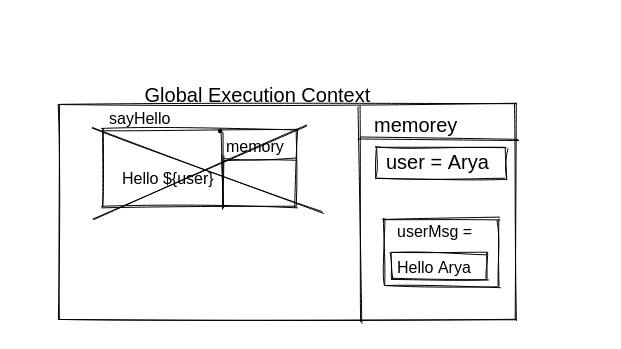
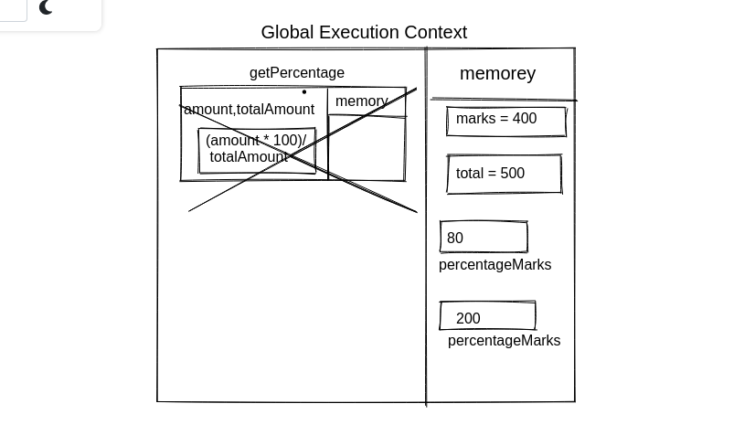
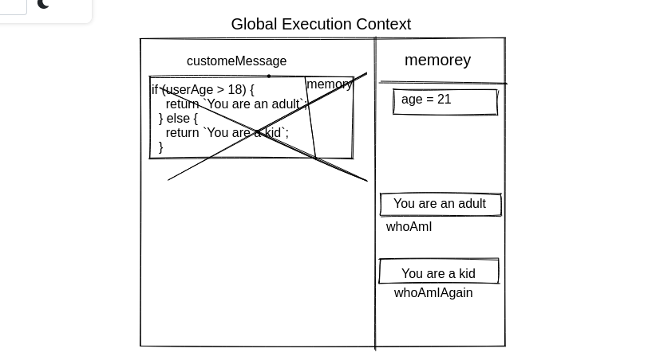

1. What does thread of execution means in JavaScript?
   answer:- Thread of execution mean to execution of code in JS engine.

2. Where the JavaScript code gets executed?
   Answer:- In JavaScript Engine.

3. What does context means in Global Execution Context?
   Answer:- Global Execution context provide us an envirment to exicute the code.

4. When do you create a global execution context.
   Answer:- Global execution context for the code executions.

5. Execution context consists of what all things?
   Answer:- It provides us envirment to executes the code or all functions.

6. What are the different types of execution context?
   Answer:- Global Execution Context,
   Function Execution Context.

7. When global and function execution context gets created?
   Answer:- When code exection we requare a ececution context.

8. Function execution gets created during function execution or while declaring a function.
   Answer:- while declaring a function

9. Create a execution context diagram of the following code on your notebook. Take a screenshot/photo and store it in the folder named `img`. Use `` to display it here.

```js
var user = "Arya";

function sayHello() {
  return `Hello ${user}`;
}

var userMsg = sayHello(user);
```

<!-- Put your image here -->



```js
var marks = 400;
var total = 500;

function getPercentage(amount, totalAmount) {
  return (amount * 100) / totalAmount;
}

var percentageMarks = getPercentage(marks, total);
var percentageProfit = getPercentage(400, 200);
```

<!-- Put your image here -->



```js
var age = 21;

function customeMessage(userAge) {
  if (userAge > 18) {
    return `You are an adult`;
  } else {
    return `You are a kid`;
  }
}

var whoAmI = customeMessage(age);
var whoAmIAgain = customeMessage(12);
```

<!-- Put your image here -->


