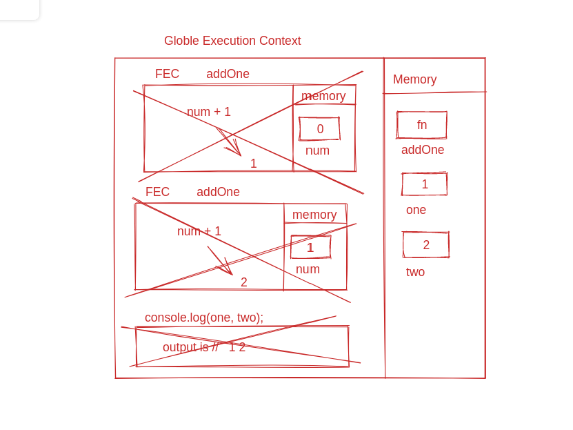
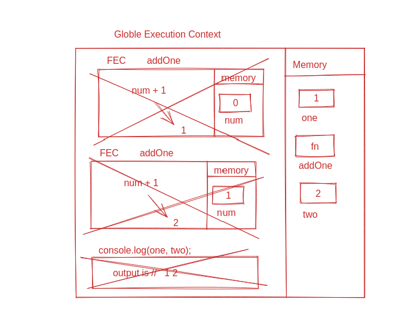
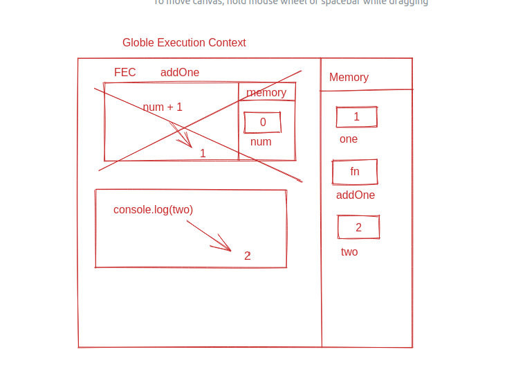

## Understanding Scope and the difference between var, let and const

Watch this video before doing the exercise: https://www.youtube.com/watch?v=XgSjoHgy3Rk

1. Guess the output:

```js
let firstName = "Arya";
const lastName = "Stark";
var knownAs = "no one";

console.log(
  window.firstName, // undefined
  window.lastName, // undefined
  window.knownAs // `no one`
);
```

2. Guess the output:

```js
let firstName = "Arya";
const lastName = "Stark";
var knownAs = "no one";

function fullName(a, b) {
  return a + b;
}

console.log(window.fullName(firstName, lastName));
// AryaStark
```

3. Make a Execution Context Diagram for the following JS and write the output.

```js
function addOne(num) {
  return num + 1;
}
var one = addOne(0);
var two = addOne(1);
console.log(one, two);

// 1 2
 

```

4. Make a Execution Context Diagram for the following JS and write the output.

```js
var one = addOne(0);
function addOne(num) {
  return num + 1;
}
var two = addOne(1);
console.log(one, two);

// 1 2
 


```

5. Make a Execution Context Diagram for the following JS and write the output.

```js
console.log(addOne(0));
function addOne(num) {
  return num + 1;
}
var two = addOne(1);
console.log(two);

 
```

6. Make a Execution Context Diagram for the following JS and write the output.

```js
var one = addOne(0);
const addOne = (num) => {
  return num + 1;
};
var two = addOne(1);
console.log(two);

// ReferenceError: addOne is not defined
// const can't define the function or var is in globle execution so that's way it can not execute without funtion defination.
```

7. Make a Execution Context Diagram for the following JS and write the output.

```js
console.log(addOne(0));
const addOne = (num) => {
  return num + 1;
};
var two = addOne(1);
console.log(two);

// ReferenceError: addOne is not defined
// const can't define the function or var is in globle execution so that's way it can not execute without funtion defination.
```

8. What will be the output of the following

```js
function isAwesome() {
  var awesome;
  if (false) {
    awesome = true;
  }
  console.log(awesome);
}
isAwesome();

// undefined
```

9. What will be the output of the following

```js
function isAwesome() {
  let awesome;
  if (true) {
    awesome = true;
  }
  console.log(awesome);
}
isAwesome();

// true
```

10. What will be the output of the following

```js
function isAwesome() {
  let awesome;
  if (false) {
    awesome = true;
  }
  console.log(awesome);
}
isAwesome();

// undefine
```

11. What will be the output of the following

```js
let firstName = "Arya";
const lastName = "Stark";
var knownAs = "no one";

function fullName(a, b) {
  return a + b;
}
const name = fullName(firstName, lastName);
console.log(name);

// AryaStark
```

12. Guess the output of the code below with a reason.

```js
function sayHello() {
  let name = "Arya Stark";
}
sayHello();

console.log(name);

// undefined
```

13. Guess the output of the code below with a reason.

```js
if (true) {
  var name = "Arya Stark";
}
console.log(name);

// Arya Stark
```

14. Guess the output of the code below with a reason.

```js
if (true) {
  let name = "Arya Stark";
}
console.log(name);

// undefined
```

15. Guess the output of the code below with a reason.

```js
for (var i = 0; i < 20; i++) {
  //
}
console.log(i);

// loop will run over 0 to 19 in var. then value of i will b 20 but it's false the condition then the value of i will  remain 20.
```

16. Guess the output of the code below with a reason.

```js
for (let i = 0; i < 20; i++) {
  //
}
console.log(i);

// let is in block scope so we can't access the value of i.
```

17. Guess the output and the reason behind that.

```js
function sample() {
  if (true) {
    var username = "John Snow";
  }
  console.log(username);
}
sample();

//  John Snow  (due to the variable is store in var that is not having a block scope)
```

18. Guess the output and the reason behind that.

```js
function sample() {
  if (true) {
    let username = "John Snow";
  }
  console.log(username);
}
sample();

// ReferenceError: username is not defined
// because username is log outside the block.
```

19. Guess the output and the reason behind that.

```js
function sample() {
  var username = "Arya Stark";
  if (true) {
    var username = "John Snow";
    console.log(username);
  }
  console.log(username, "second");
}
sample();
// John Snow
// John Snow second
// Reason:- In this cash both are in global scope that's why bottom value is call.
```

20. Guess the output and the reason behind that.

```js
function sample() {
  let username = "Arya Stark";
  if (true) {
    let username = "John Snow";
    console.log(username, "first");
  }
  console.log(username, "second");
}
sample();
// John Snow first
// Arya Stark second
// Reason:- first username is same block and second is in same block.
```

21. Guess the output and the reason behind that.

```js
function sample(...args) {
  for (let i = 0; i < args.length; i++) {
    let message = `Hello I am ${args[i]}`;
    console.log(message);
  }
}

sample("First", "Second", "Third");
// Hello I am First
// Hello I am Second
// Hello I am Third

// Reason:-   tripal dot oprater will does the the all parameter in one array.
```

22. Guess the output and the reason behind that.

```js
function sample(...args) {
  for (let i = 0; i < args.length; i++) {
    const message = `Hello I am ${args[i]}`;
    console.log(message);
  }
}

sample("First", "Second", "Third");

// Hello I am First
// Hello I am Second
// Hello I am Third
```

23. Guess the output and the reason behind that.

```js
if (true) {
  const myFunc = function () {
    console.log(username, "Second");
  };
  console.log(username, "First");
  let username = "Hello World!";
  myFunc();
}

// ReferenceError: username is not defined.
// Reason :- username is define after call. so their is no value in username.
```

24. Guess the output and the reason behind that.

```js
function outer() {
  let movie = "Mad Max: Fury Road";
  function inner() {
    console.log(`I love this movie called ${movie.toUpperCase()}`);
  }
  inner();
}

outer();

// I love this movie called MAD MAX: FURY ROAD
// Reason:- When we call the  inner funtion it will execute then the movie value will call by the perent element.
```

25. Guess the output and the reason behind that.

```js
function outer() {
  let movie = "Mad Max: Fury Road";
  function inner() {
    let movie = "Before Sunrise";
    console.log(`I love this movie called ${movie.toUpperCase()}`);
  }
  inner();
}

outer();

// I love this movie called BEFORE SUNRISE
// Reason :- first the element search for the same block the bubble out.
```

26. Guess the output and the reason behind that.

```js
function outer() {
  let movie = "Mad Max: Fury Road";
  function inner() {
    let movie = "Before Sunrise";
    function extraInner() {
      let movie = "Gone Girl";
      console.log(`I love this movie called ${movie.toUpperCase()}`);
    }
    extraInner();
  }
  inner();
}
outer();

// I love this movie called GONE GIRL
// Reason :- first the element search for the same block the bubble out.
```

30. Using reduce find the final value when the initial value passed is `100`. You have to pass the output of one function into the input of next function in the array `allFunctions` starts with `addOne` ends with `half`.

```js
const addOne = (num) => {
  return num + 1;
};
const subTwo = (num) => {
  return num - 2;
};
const multiplyThree = (num) => {
  return num * 3;
};
const half = (num) => {
  return num / 2;
};

let allFunctions = [addOne, subTwo, multiplyThree, addOne, multiplyThree, half];

let final = allFunctions.reduce((accu, cv) => {
  accu = cv(accu);
  return accu;
}, 100);

// Answer is: 447
```
